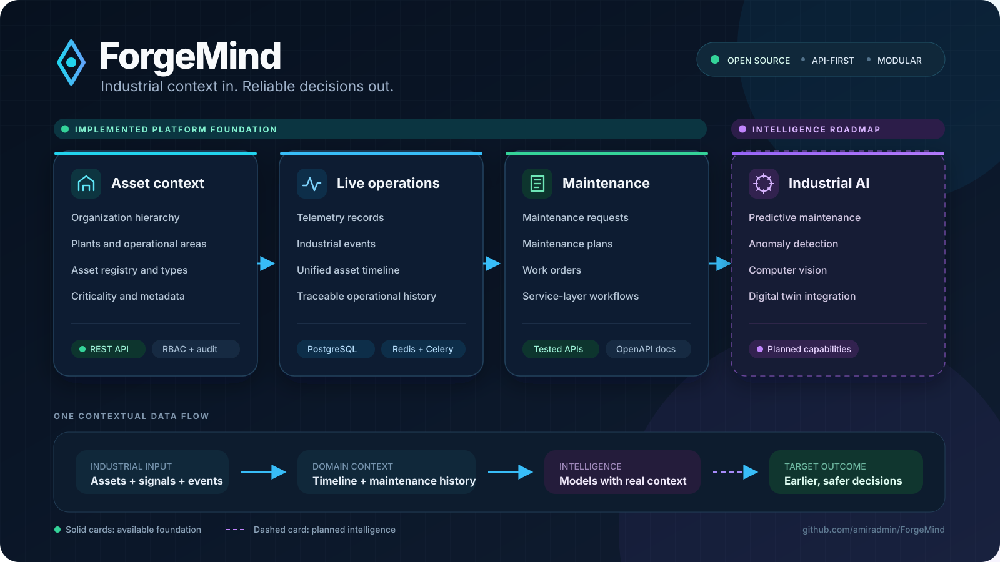

# 🚀 ForgeMind

[](https://github.com/amiradmin/ForgeMind/actions/workflows/backend-ci.yml)
[](https://github.com/amiradmin/ForgeMind/releases/latest)
[](LICENSE)

> **Industrial AI & Enterprise Intelligence Platform for Heavy Industry**

ForgeMind is an open-source, modular platform for industrial organizations that want to connect **assets, telemetry, operations, maintenance, and AI** in one system.

The platform is designed for industries such as steel, mining, cement, power generation, oil & gas, and advanced manufacturing.

ForgeMind is being developed with a production-oriented engineering approach: modular Django architecture, REST APIs, PostgreSQL, Redis/Celery, Docker, automated testing, CI, and an extensible AI services layer.

<p align="center">
  
</p>

<p align="center"><sub>Solid cards show the implemented platform foundation. The dashed card shows planned intelligence capabilities.</sub></p>

---

## 🌍 Vision

Industrial organizations often operate separate systems for asset management, maintenance, telemetry, energy, production analytics, and AI.

ForgeMind aims to provide a unified intelligence layer across these systems:

- **Asset Management**
- **Industrial Telemetry**
- **Operational Timeline & Events**
- **Maintenance & CMMS**
- **Energy Monitoring**
- **Predictive Maintenance**
- **Computer Vision**
- **Industrial Analytics**
- **AI-assisted Decision Support**
- **Digital Twin Integration**

The long-term goal is to move from **monitoring what happened** to **understanding why it happened and predicting what will happen next**.

---

## 🧠 Core Domain Model

ForgeMind is being structured around the industrial lifecycle:

```text
Organization
     │
     └── Plant
           │
           └── Area
                 │
                 └── Asset
                       │
             ┌─────────┴─────────┐
             ▼                   ▼
        Telemetry            Operations
             │                   │
             └─────────┬─────────┘
                       ▼
              Events / Timeline
                       │
                       ▼
                 Maintenance
                       │
                       ▼
                Failure History
                       │
                       ▼
             Predictive Intelligence
```

This domain foundation allows future AI models to operate on real industrial context instead of existing as isolated machine-learning components.

---

## ✨ Current Platform Foundation

### Backend

- Django-based modular architecture
- Django REST Framework APIs
- Custom identity/authentication layer
- JWT authentication
- Organization and asset domain foundations
- Telemetry domain foundations
- Maintenance domain foundations
- Operational timeline and audit capabilities
- Health-check endpoint
- Environment-based configuration
- Modular settings

### Infrastructure

- PostgreSQL
- Redis
- Celery
- Docker / Docker Compose
- GitHub Actions CI
- Pytest
- Ruff / Black / isort tooling

The repository currently contains dedicated Django applications for areas including `identity`, `assets`, `telemetry`, `maintenance`, `operational_timeline`, `audit`, and `core`.

---

## 🏭 Product Roadmap

### Foundation

- [x] Project foundation
- [x] Docker development environment
- [x] PostgreSQL / Redis infrastructure
- [x] Environment-based configuration
- [x] Authentication foundation
- [x] REST API foundation
- [x] CI foundation

### Industrial Core

- [ ] Complete Organization hierarchy
- [ ] Complete Plant / Area management
- [ ] Complete Asset Registry
- [ ] Asset relationships and criticality
- [ ] Industrial telemetry ingestion
- [ ] Operational events and timeline
- [ ] Audit and traceability

### Maintenance / CMMS

- [ ] Work Orders
- [ ] Preventive Maintenance
- [ ] Corrective Maintenance
- [ ] Maintenance Plans
- [ ] Spare Parts Inventory
- [ ] Maintenance KPIs
- [ ] Failure history and root-cause data

### Energy & Operations

- [ ] Energy monitoring
- [ ] Energy KPIs
- [ ] Energy anomaly detection
- [ ] Energy forecasting
- [ ] Production/operations analytics

### Industrial AI

- [ ] Predictive Maintenance
- [ ] Remaining Useful Life (RUL)
- [ ] Failure prediction
- [ ] Anomaly detection
- [ ] AI-assisted maintenance decisions
- [ ] Computer Vision
- [ ] Conveyor monitoring
- [ ] Industrial AI assistant
- [ ] Digital Twin integration

---

## 🏗 Architecture

```text
                         Frontend
                            │
                            │ REST API
                            ▼
                  Django REST Framework
                            │
       ┌────────────────────┼────────────────────┐
       │                    │                    │
       ▼                    ▼                    ▼
    Identity             Assets              Telemetry
       │                    │                    │
       └────────────────────┼────────────────────┘
                            ▼
                  Operational Timeline
                            │
                            ▼
                       Maintenance
                            │
                            ▼
                    Industrial Data Layer
                            │
              ┌─────────────┼─────────────┐
              ▼             ▼             ▼
        Predictive AI   Computer Vision  Analytics
              │             │             │
              └─────────────┼─────────────┘
                            ▼
                       AI Services
                            │
              ┌─────────────┴─────────────┐
              ▼                           ▼
         PostgreSQL                   Redis/Celery
```

The architecture is intentionally modular so that AI and data-intensive services can evolve independently from the transactional Django domain.

---

## 🛠 Technology Stack

| Layer | Technologies |
|---|---|
| Backend | Python, Django, Django REST Framework |
| Authentication | JWT / SimpleJWT |
| Database | PostgreSQL |
| Async / Queue | Redis, Celery |
| Testing | Pytest |
| Code Quality | Ruff, Black, isort |
| Infrastructure | Docker, Docker Compose |
| CI/CD | GitHub Actions |
| AI / ML | PyTorch, Scikit-learn |
| Computer Vision | OpenCV, YOLO |
| Frontend | React / TypeScript (planned / evolving) |

---

## 📂 Repository Structure

```text
ForgeMind/
│
├── backend/
│   ├── apps/
│   │   ├── assets/
│   │   ├── audit/
│   │   ├── core/
│   │   ├── identity/
│   │   ├── maintenance/
│   │   ├── operational_timeline/
│   │   └── telemetry/
│   │
│   └── config/
│       ├── settings/
│       ├── celery.py
│       ├── urls.py
│       └── ...
│
├── frontend/
├── services/
├── docs/
├── infrastructure/
├── scripts/
└── .github/
    └── workflows/
```

---

## 🚧 Development Status

ForgeMind is currently in the **industrial platform foundation phase**.

The project has moved beyond basic project setup and authentication and is now building the core domain required for a production-grade industrial platform: **organizations, assets, telemetry, operational history, and maintenance**.

The immediate priority is to establish a strong and consistent industrial data model before adding advanced predictive models and AI services.

---

## 🎯 Engineering Principles

ForgeMind is being built around several principles:

1. **Domain-first architecture** — industrial concepts come before AI features.
2. **Modularity** — each business capability should remain independently maintainable.
3. **Traceability** — industrial events and maintenance decisions should be auditable.
4. **Production readiness** — testing, CI, configuration, security, and observability matter from the beginning.
5. **AI with context** — predictive models should consume meaningful industrial data and operational history.
6. **Incremental delivery** — build a reliable industrial core before introducing complex AI workloads.
7. **Cloud-ready design** — services should be deployable independently as the platform grows.

---

## 🧪 Development

### Docker quickstart

Clone the repository and prepare the development environment:

```bash
git clone https://github.com/amiradmin/ForgeMind.git
cd ForgeMind
cp .env.example backend/.env
```

Start PostgreSQL, Redis, Django, Celery worker, and Celery beat:

```bash
cd infrastructure/compose
docker compose up --build -d
docker compose exec backend python manage.py migrate
```

Verify the running platform:

```bash
curl http://localhost:8000/api/v1/health/
```

Interactive API documentation is available at:

- Swagger UI: http://localhost:8000/api/docs/
- ReDoc: http://localhost:8000/api/redoc/

The first public foundation release is tracked as `v0.1.0`. See [CHANGELOG.md](CHANGELOG.md) for release details.

Run the test suite from the backend directory with the project's configured Pytest setup.

---

## 🌐 Community & Collaboration

ForgeMind is open to contributors and collaborators from Iran and around the world.

You can participate as an industrial engineer, backend or frontend developer, data engineer, ML/CV engineer, researcher, technical writer, or product contributor.

### Start here

If you are new to the project, use these curated queues instead of scanning the full backlog:

- [Good first issues](https://github.com/amiradmin/ForgeMind/issues?q=is%3Aissue%20state%3Aopen%20label%3A%22good%20first%20issue%22) — small, bounded newcomer tasks
- [Help wanted](https://github.com/amiradmin/ForgeMind/issues?q=is%3Aissue%20state%3Aopen%20label%3A%22help%20wanted%22) — contributions where outside help is especially welcome
- [GitHub Discussions](https://github.com/amiradmin/ForgeMind/discussions) — introductions, questions, architecture conversations, and industrial use cases

A few useful entry points:

- [Verify the 10-minute quickstart](https://github.com/amiradmin/ForgeMind/issues/122) — fresh-clone verification and contributor documentation
- [Add the first API walkthrough](https://github.com/amiradmin/ForgeMind/issues/128) — copy-pasteable Django/DRF API examples
- [Configure pre-commit hooks](https://github.com/amiradmin/ForgeMind/issues/130) — small Python tooling contribution
- [Create the documentation index](https://github.com/amiradmin/ForgeMind/issues/131) — newcomer-friendly documentation navigation
- [Review industrial terminology](https://github.com/amiradmin/ForgeMind/issues/124) — industrial expertise welcome; no coding required

Then:

- Read the [contribution guide](CONTRIBUTING.md)
- Comment on a focused issue with your intended approach before starting
- Report a reproducible bug through the Bug Report issue form
- Propose a capability through the Feature Request issue form
- Submit an open-source, research, or industrial collaboration through the Collaboration Proposal issue form
- Review the [support](SUPPORT.md), [security](SECURITY.md), and [community](CODE_OF_CONDUCT.md) policies

English and Persian participation are both welcome. Shared technical documentation is maintained primarily in English so the widest community can collaborate.

---

## 🤝 Contributing

ForgeMind is an open-source engineering project.

Contributions, technical discussions, architecture suggestions, and industrial use cases are welcome.

For substantial changes, please open an Issue first to discuss the proposed direction.

---

## 📜 License

ForgeMind is distributed under the **Apache License 2.0**.

---

## 👨‍💻 Author

**Amir Behvandi**

Software Engineer focused on:

- Industrial AI
- Django / Python
- Computer Vision
- Predictive Maintenance
- Enterprise Software Architecture

GitHub: https://github.com/amiradmin

---

⭐ If you are interested in Industrial AI, Predictive Maintenance, or intelligent enterprise platforms, consider starring the project.

Copyright 2026 Amir Behvandi
